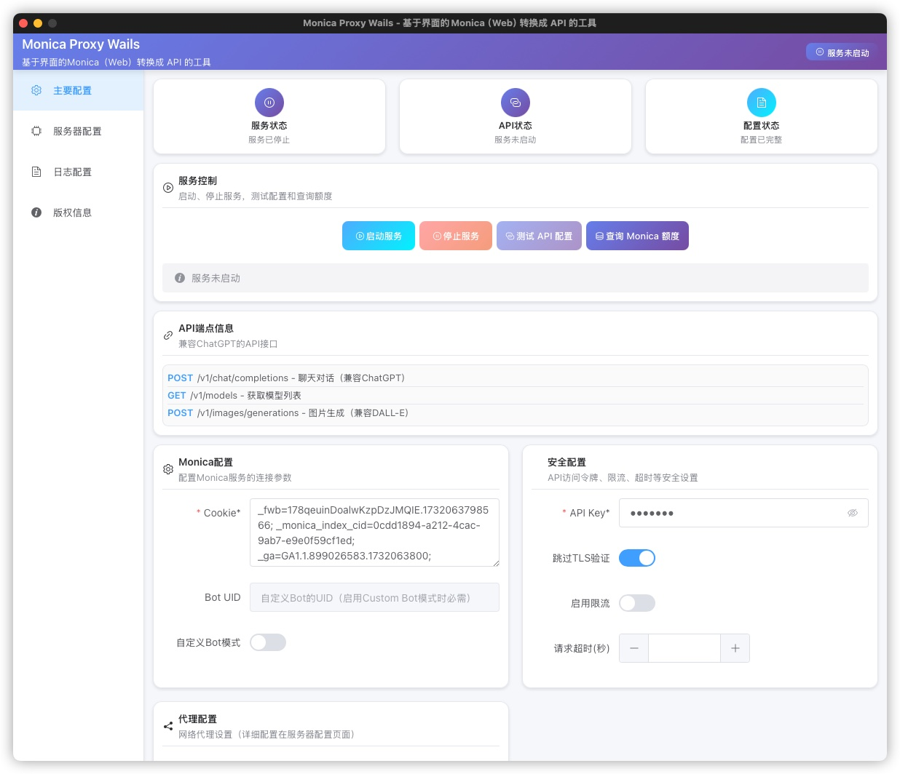
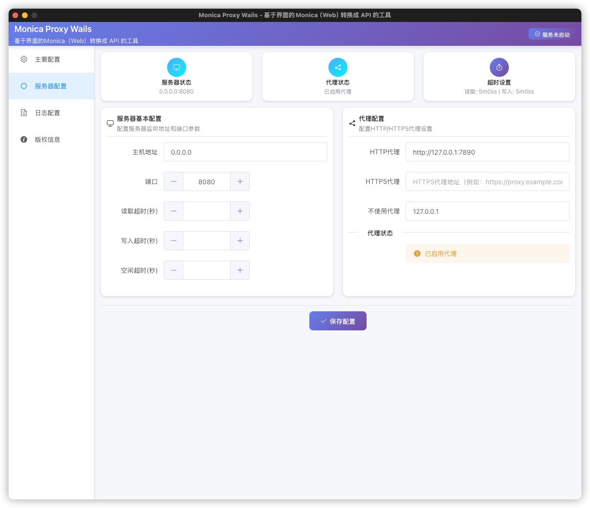
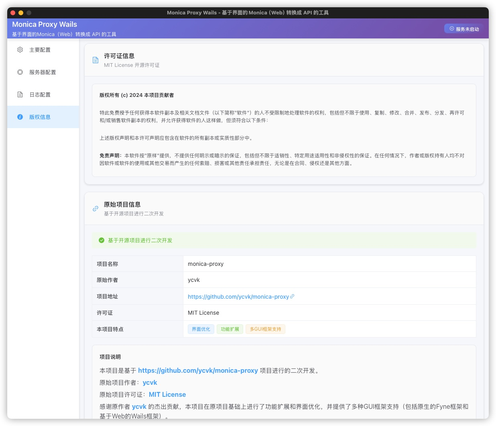

# Monica Proxy - 多GUI版本

**Monica AI 代理服务**

将 Monica AI 转换为 ChatGPT 兼容的 API，支持完整的 OpenAI 接口兼容性，提供GUI界面进行整体管理。


## 项目来源
本项目基于 [https://github.com/ycvk/monica-proxy](https://github.com/ycvk/monica-proxy) 项目进行二次开发。

## ✨ **功能特性**

### 🔗 **API兼容性**

- ✅ **完整的System Prompt支持** - 通过Custom Bot Mode实现真正的系统提示词
- ✅ **ChatGPT API完全兼容** - 无缝替换OpenAI接口，支持所有标准参数
- ✅ **流式响应** - 完整的SSE流式对话体验，支持实时输出
- ✅ **Monica模型支持** - GPT-4o、Claude-4、Gemini等主流模型完整映射
- ✅ **多文件类型支持** - 文档、图片、音频、视频等多种格式自动处理
- ✅ **文件管理API** - OpenAI兼容的文件上传、管理和删除接口

## ✨ **必要提示**
1. 本项目是模拟http请求，来使用你的Monica账号进行请求。如果对应的模型、服务要消耗Monica高级积分，这个程序不能幸免；
2. 本项目不确定会不会导致你的账号被封，这是非常重要的风险提示，风险自担 ， 当然你可以二次审计修改；
3. 目前不支持工具调用

## 🚀 **快速开始**

本项目提供两种GUI版本，您可以选择适合的版本使用：

### 版本对比

| 特性 | Fyne版本 (原版) | Wails版本 (新版) |
|------|----------------|-----------------|
| GUI框架 | Fyne v2 | Wails v2 + Vue.js + Element Plus |
| 界面风格 | 原生桌面应用风格 | Web风格，更现代化 |
| 技术栈 | Go + Fyne | Go + Vue.js + Element Plus |
| 可执行文件大小 | 较小 (~15MB) | 较大 (~50MB) |
| 界面响应速度 | 快 | 适中 |
| 界面定制性 | 中等 | 高 (Web技术) |
| 开发难度 | 简单 | 中等 |

### 🖥️ **Fyne版本 (原版)**

传统的原生GUI应用，使用Fyne框架构建，界面简洁高效。

```bash
# 编译Fyne版本
go build -o monica-proxy-fyne main.go

# 启动Fyne GUI
./monica-proxy-fyne

# 启动命令行模式
./monica-proxy-fyne -cli
```

### 🌐 **Wails版本 (新版)**

现代化的Web风格GUI应用，使用Wails v2 + Vue.js + Element Plus构建，界面更美观，功能更丰富。

#### 前置要求
- Go 1.18+
- Node.js 16+ 
- npm 或 yarn

#### 构建Wails版本

```bash
# 方法1：使用自动化脚本 (推荐)
./build-wails.sh

# 方法2：手动构建
cd frontend
npm install
cd ..
wails build
```

#### 启动Wails版本

```bash
# 构建后的可执行文件
./build/bin/monica-proxy-wails
```

#### 开发模式运行

```bash
# 启动开发模式 (前端热重载)
wails dev
```

### 测试API

```bash
curl -H "Authorization: Bearer your_bearer_token" \
     http://localhost:8080/v1/models
```

## 🏗️ 界面预览





## 🏗️ **部署指南**

### 🔧 **源码编译**

#### Fyne版本编译

需要将fyne版本文件恢复

```bash
# 克隆项目
git clone https://github.com/SimonUTD/monica-proxy-gui
cd monica-proxy-gui

# 编译
go build -o monica-proxy-fyne main.go

# 命令行模式运行
export MONICA_COOKIE="your_cookie"
export BEARER_TOKEN="your_token"
# export BOT_UID="your_bot_uid"  # 可选，用于Custom Bot模式
./monica-proxy-fyne -cli

# 或者启动GUI配置界面（默认）
./monica-proxy-fyne
```

#### Wails版本编译(当前)

```bash
# 克隆项目
git clone https://github.com/SimonUTD/monica-proxy-gui
cd monica-proxy-gui

# 安装Wails CLI
go install github.com/wailsapp/wails/v2/cmd/wails@latest

# 使用自动化脚本构建 (推荐)
./build-wails.sh

# 或者手动构建
cd frontend && npm install && cd ..
wails build

# 运行Wails版本
./build/bin/monica-proxy-wails
```

## ⚙️ **配置参考**

### 🖥️ **GUI配置界面**

Monica Proxy 现在支持两种GUI版本，均支持图形用户界面配置，可以方便地配置所有环境变量：

- **必填项**：Monica Cookie、Bearer Token（带有*标记）
- **选填项**：其他所有配置项都可以通过GUI界面进行配置
- **保存配置**：点击"保存配置"按钮将配置保存到 `config.yaml` 文件中
- **服务控制**：可以直接在GUI中启动和停止服务

#### 启动GUI模式

##### Fyne版本启动

```bash
# 方法1：直接运行Fyne版本
./monica-proxy-fyne

# 方法2：编译后运行Fyne版本
go build -o monica-proxy-fyne main.go
./monica-proxy-fyne
```

##### Wails版本启动

```bash
# 方法1：运行Wails版本
./build/bin/monica-proxy-wails

# 方法2：开发模式运行Wails版本
wails dev
```

#### GUI界面说明

两个版本的GUI界面都提供以下功能：

1. **主要配置**：Monica配置、安全配置、服务控制
2. **服务器配置**：HTTP服务器配置、代理设置
3. **日志配置**：日志级别、格式、输出方式配置
4. **版权信息**：项目信息和许可证

**界面特性对比：**

- **Fyne版本**：原生桌面界面，简洁高效，启动快速，占用资源少
- **Wails版本**：现代化Web界面，美观丰富，交互体验好，功能更完整

两个版本的配置文件格式完全兼容，可以共享使用。

#### 使用步骤

1. 启动程序（默认启动GUI界面）
2. 在相应字段中输入配置信息（必填项带有*标记）
3. 点击"保存配置"按钮将配置保存到config.yaml文件
4. 点击"启动服务"按钮启动HTTP服务
5. 使用"停止服务"按钮可以停止正在运行的服务

### 命令行模式

如果需要以命令行模式运行，可以使用 `-cli` 参数：

```bash
./monica-proxy -cli
```

命令行模式下，程序会直接读取配置文件和环境变量启动HTTP服务，不显示GUI界面。

## 🔌 **API使用**

### 支持的端点

- `POST /v1/chat/completions` - 聊天对话（兼容ChatGPT）
- `GET /v1/models` - 获取模型列表
- `POST /v1/images/generations` - 图片生成（兼容DALL-E）
- `POST /v1/files` - 文件上传（支持文档、图片、音频等）
- `GET /v1/files/:file_id` - 获取文件信息
- `GET /v1/files` - 列出文件
- `DELETE /v1/files/:file_id` - 删除文件

### 认证方式

```http
Authorization: Bearer YOUR_BEARER_TOKEN
```

### 聊天API示例

```bash
curl -X POST http://localhost:8080/v1/chat/completions \
  -H "Authorization: Bearer your_token" \
  -H "Content-Type: application/json" \
  -d '{
    "model": "gpt-4o",
    "messages": [
      {"role": "system", "content": "你是一个有帮助的助手"},
      {"role": "user", "content": "你好"}
    ],
    "stream": true
  }'
```

### 文件上传API示例

```bash
# 上传文档文件
curl -X POST http://localhost:8080/v1/files \
  -H "Authorization: Bearer your_token" \
  -F "file=@document.pdf" \
  -F "purpose=assistants"

# 在聊天中使用已上传的文件
curl -X POST http://localhost:8080/v1/chat/completions \
  -H "Authorization: Bearer your_token" \
  -H "Content-Type: application/json" \
  -d '{
    "model": "gpt-4o",
    "messages": [
      {
        "role": "user",
        "content": [
          {"type": "text", "text": "请分析这个文档的内容"},
          {"type": "image_url", "image_url": {"url": "data:image/jpeg;base64,..."}}
        ]
      }
    ]
  }'
```

### 支持的文件类型

| 文件类别   | 支持格式                                                      | 最大大小 | 说明           |
|--------|-----------------------------------------------------------|------|--------------|
| **文档**   | PDF, DOC, DOCX, XLS, XLSX, PPT, PPTX                    | 100MB | 自动解析文档内容     |
| **文本**   | TXT, MD, CSV, JSON, XML                                   | 100MB | 纯文本文件        |
| **代码**   | JS, HTML, CSS, PY, 等                                      | 100MB | 代码文件         |
| **图片**   | JPEG, PNG, GIF, WebP                                     | 10MB  | 图像识别和分析      |
| **音频**   | MP3, WAV, OGG, M4A                                        | 100MB | 音频转录（如支持）    |
| **视频**   | MP4, AVI, MOV                                             | 100MB | 视频分析（如支持）    |

### 支持的模型

| 模型系列         | 模型名称                                                                                             | 说明                 |
|--------------|--------------------------------------------------------------------------------------------------|--------------------|
| **GPT系列**    | `gpt-5`, `gpt-4o`, `gpt-4o-mini`, `gpt-4.1`, `gpt-4.1-mini`, `gpt-4.1-nano`, `gpt-4-5`           | OpenAI GPT模型       |
| **Claude系列** | `claude-4-sonnet`, `claude-4-opus`, `claude-3-7-sonnet`, `claude-3-5-sonnet`, `claude-3-5-haiku` | Anthropic Claude模型 |  
| **Gemini系列** | `gemini-2.5-pro`, `gemini-2.5-flash`, `gemini-2.0-flash`, `gemini-1`                             | Google Gemini模型    |
| **O系列**      | `o1-preview`, `o3`, `o3-mini`, `o4-mini`                                                         | OpenAI O系列模型       |
| **其他**       | `deepseek-reasoner`, `deepseek-chat`, `grok-3-beta`, `grok-4`, `sonar`, `sonar-reasoning-pro`    | 专业模型               |

## 🛠️ **高级功能**

### Custom Bot Mode（系统提示词支持）

通过启用 Custom Bot Mode，可以让所有的聊天请求都支持系统提示词（system prompt）功能：
1、启用 Custom Bot Mode
2、设置BOT_UID （必须）
```bash

⬇️ 启动项目后 ⬇️

# 现在所有 /v1/chat/completions 请求都支持 system prompt
curl -X POST http://localhost:8080/v1/chat/completions \
  -H "Authorization: Bearer your_token" \
  -H "Content-Type: application/json" \
  -d '{
    "model": "gpt-4o",
    "messages": [
      {
        "role": "system",
        "content": "你是一个海盗船长，用海盗的口吻说话"
      },
      {
        "role": "user",
        "content": "介绍一下你自己"
      }
    ]
  }'
```


---

<div align="center">

**如果这个项目对你有帮助，请给个 ⭐️ Star！**

</div>

## 📄 **许可证**

本项目采用 MIT 许可证 - 查看 [LICENSE](LICENSE) 文件了解详情


### 原项目许可证
原项目采用 MIT 许可证，其许可证内容如下：

```
MIT License

Copyright (c) 2024 Monica Proxy

Permission is hereby granted, free of charge, to any person obtaining a copy
of this software and associated documentation files (the "Software"), to deal
in the Software without restriction, including without limitation the rights
to use, copy, modify, merge, publish, distribute, sublicense, and/or sell
copies of the Software, and to permit persons to whom the Software is
furnished to do so, subject to the following conditions:

The above copyright notice and this permission notice shall be included in all
copies or substantial portions of the Software.

THE SOFTWARE IS PROVIDED "AS IS", WITHOUT WARRANTY OF ANY KIND, EXPRESS OR
IMPLIED, INCLUDING BUT NOT LIMITED TO THE WARRANTIES OF MERCHANTABILITY,
FITNESS FOR A PARTICULAR PURPOSE AND NONINFRINGEMENT. IN NO EVENT SHALL THE
AUTHORS OR COPYRIGHT HOLDERS BE LIABLE FOR ANY CLAIM, DAMAGES OR OTHER
LIABILITY, WHETHER IN AN ACTION OF CONTRACT, TORT OR OTHERWISE, ARISING FROM,
OUT OF OR IN CONNECTION WITH THE SOFTWARE OR THE USE OR OTHER DEALINGS IN THE
SOFTWARE.
```

### 本项目许可证
本项目同样采用 MIT 许可证 - 查看 [LICENSE](LICENSE) 文件了解详情。

### 致谢
感谢原作者 [ycvk](https://github.com/ycvk) 创建了优秀的 Monica Proxy 项目，为本项目提供了坚实的基础。
